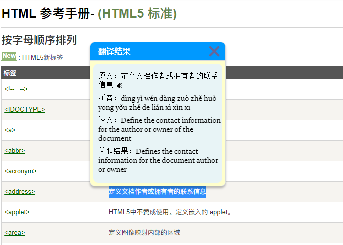
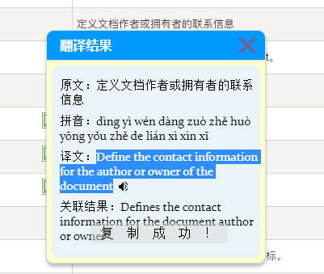
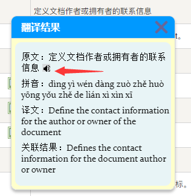

# 零 使用教程
## 0.1 开发
源文件存储在 `src` 目录中

目录结构：

+ ```
  src---------------------源根目录
  ├─assets----------------静态资源
  ├─background------------后台js
  ├─module----------------模块化js
  ├─popup-----------------popupjs
  ├─scripts---------------content_script
  └─static----------------静态资源
  ```

## 0.2 使用
打包命令：`npm run build` | `npm run dev`

开发导入Chrome：直接将`src`目录导入扩展目录

打包完成导入：将`dist`目录导入扩展

# 一 选中翻译
## 1.1 简介
Chrome-TAR-Tool属于Chrome扩展，是对页面选中文本进行翻译。

翻译功能API来源：Google翻译免费API

## 1.2 功能截图
**功能1：翻译页面**

+ 

**功能2：翻译结果快速复制**

+ 

**功能3：朗读翻译结果**

+ 

# 后记
由于作者暂未拥有Chrome开发者账号，所以暂未将应用发布到Chrome应用商店

PS：要交5美元，作者要去开通国际银行卡，敬请期待！！